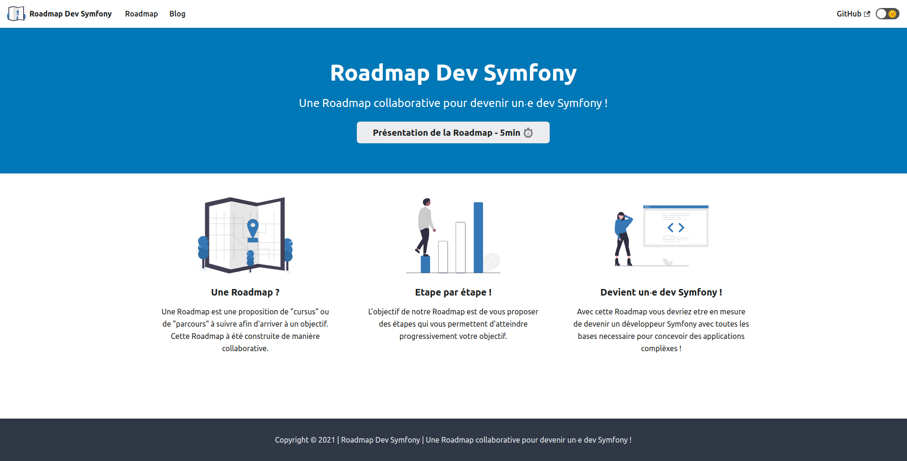

# Roadmap Dev Symfony

Une Roadmap collaborative pour devenir un⸱e dev Symfony !

👀 **La version consultable est disponible à cette adresse : [https://yoanbernabeu.github.io/Roadmap-Dev-Symfony/](https://yoanbernabeu.github.io/Roadmap-Dev-Symfony/)**



*Ce site web est construit avec [Docusaurus 2](https://docusaurus.io/).*

## ✍ Comment contribuer au projet ?

Vous souhaitez contribuer au projet ? **Merci !**

### Quoi faire ?

Il y a pleins de possibilités pour contribuer au projet :

* Soumettre des issues
* Traiter une issue
* Corriger une faute
* Ajouter un lien vers une ressource
* etc

*Nous attirons votre attention : **notre roadmap n'a pas vocation à dispenser du contenu** pédagogique (cours, tutos, etc ...), mais seulement à **rediriger vers du contenu déjà existant**. Notre plus-value est de **proposer un chemin d'apprentissage** complet et cohérent.*

### Comment faire ?

Nous vous invitons à prendre connaissance de notre [guide de contribution](CONTRIBUTING.md).

En synthèse, les étapes pour contribuer :

* **Forker** le projet
* Réaliser vos ajouts, modifications ou corrections, si possible dans **une et une** seule thématique
* Soumettre vos modifications via une **Pull Request**

Vos modifications seront **review** par la communauté, et eventuellement intégrées dans la branche **main**.

Dans un second temps, la branche **main** sera mergée dans la branche **documentation**, ce qui aura pour effet de déclencher la pipeline de déploiement de la version disponible à cette adresse : [https://yoanbernabeu.github.io/Roadmap-Dev-Symfony/](https://yoanbernabeu.github.io/Roadmap-Dev-Symfony/)

## 🚴‍♀️ Lancer le projet en local

### Prérequis

Node.js version >= 14 ou supérieure (qui peut être vérifiée en exécutant node -v).

*Vous pouvez utiliser [nvm](https://github.com/nvm-sh/nvm) pour gérer plusieurs versions de Node sur une seule machine installée*

### Installation

```
$ npm install
```

### Serveur de développement

```
$ npm start
```

### Builder l'application en local

```
$ npm run build
```

cette commande génère une version statique du site dans un répertoire `build`.